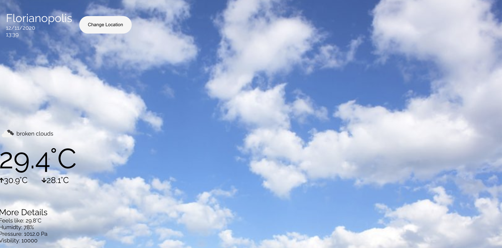

# Weather App

</img>

This weather app was built with modern React, using Hooks and the Context API.

The data shown is obtained from the [Open Weather Map Api](https://openweathermap.org/api).

To run ir locally, just clone the repository and install the dependencies with npm install. Then run the application with npm start.